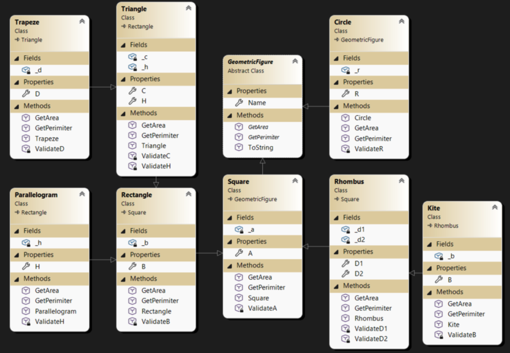
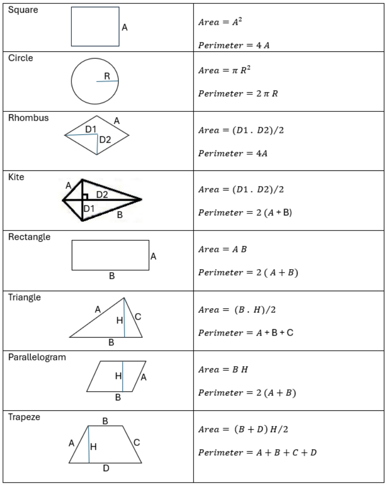
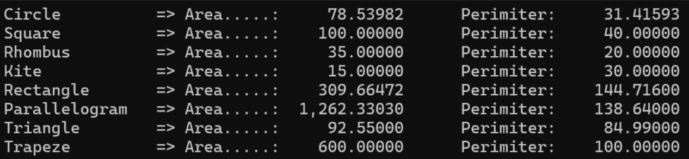
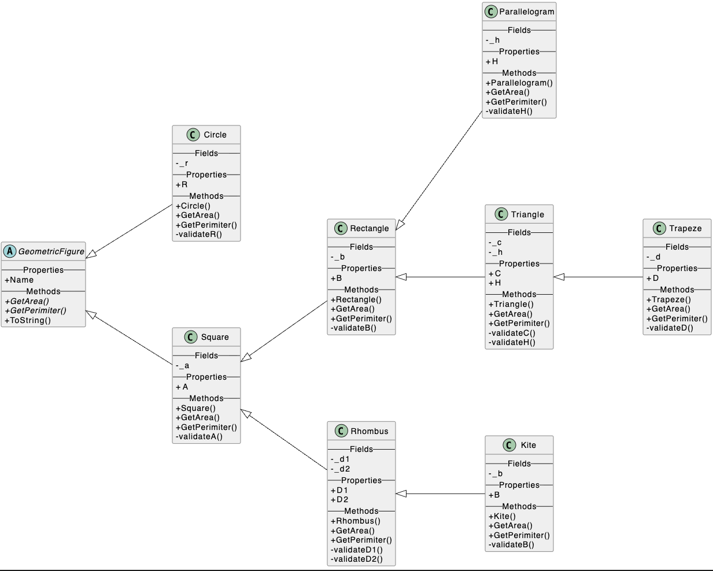

# Geometric Figures Logic - C# & .NET 10

This project demonstrates the implementation of a geometric figure hierarchy using **Object-Oriented Programming (OOP)** principles in C#. It includes advanced encapsulation, inheritance, and automated documentation through PlantUML.

## Features

* **Abstract Hierarchy**: Base `GeometricFigure` class with abstract methods for area and perimeter.
* **Encapsulation**: Strict use of private fields and public properties to protect data integrity.
* **Logic Validation**: Internal validation for dimensions (e.g., radius, side lengths) within constructors and private methods.
* **Automated UML**: Custom Bash scripts to generate professional, labeled class diagrams from source code.
* **Static Analysis**: Integrated **Roslyn Analyzers** and `dotnet-format` to ensure industry-standard code quality.

## Project Structure

* `Backend/`: Contains the core C# classes (Circle, Square, Trapeze, etc.).
* `generate_diagram.sh`: Bash script to automate PlantUML diagram generation for Mac/Linux.
* `FinalDiagram.puml`: The generated professional class diagram.

## Technical Stack

* **Language**: C# 13 (.NET 10).
* **Linter**: Microsoft CodeAnalysis NetAnalyzers.
* **Diagramming**: PlantUML via custom automation.
* **Environment**: Developed on Apple Silicon (M3 Pro).

## Class Diagram

The project structure is visualized below. The diagram is automatically categorized into **Fields**, **Properties**, and **Methods** for maximum clarity.





## Output


## 🔧 Setup & Installation

1.  **Clone the repository**:
    ```bash
    git clone https://github.com/dcanosu/GeomericFigures.git
    cd GeometricFigures/GeometricFigures
    ```
2.  **Restore dependencies and lint**:
    ```bash
    dotnet restore
    ```
3.  **Run the project**:
    ```bash
    dotnet build
    ```

4. **Run the application:**
    ```bash
    dotnet run --project Frontend

## 📜 Automation Script

To regenerate the UML diagrams with the "Fields", "Properties", and "Methods" labels, run:
```bash
cd GeometricFigures/Backend/Models
chmod +x generate_diagram.sh
./generate_diagram.sh
```


